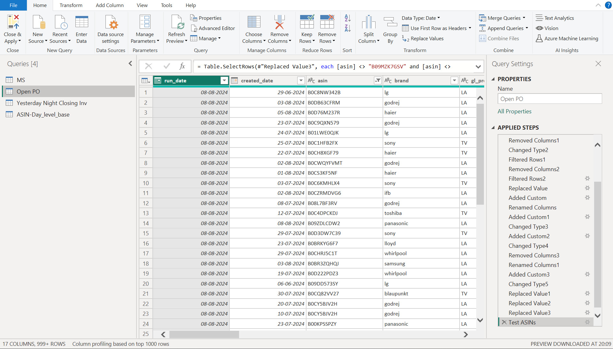
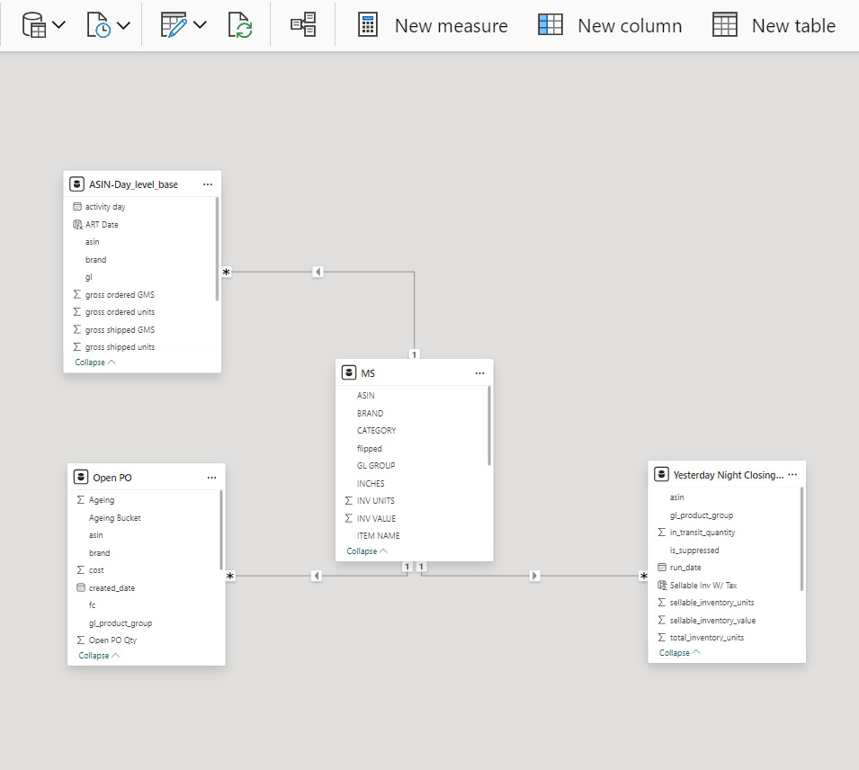
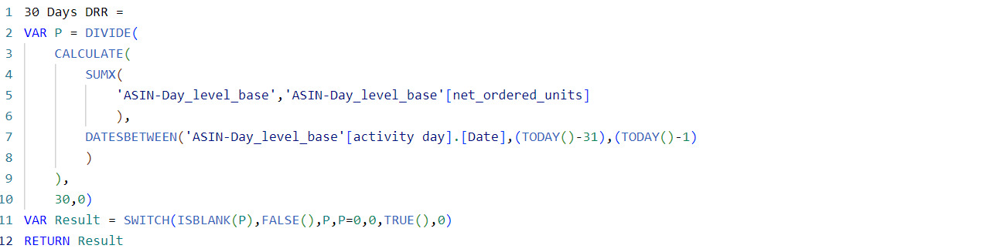
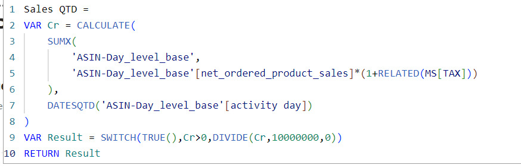
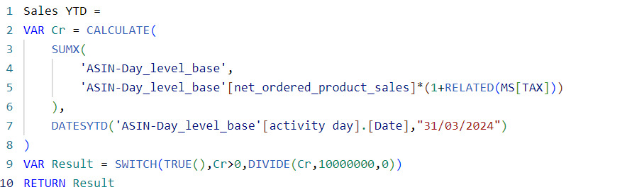
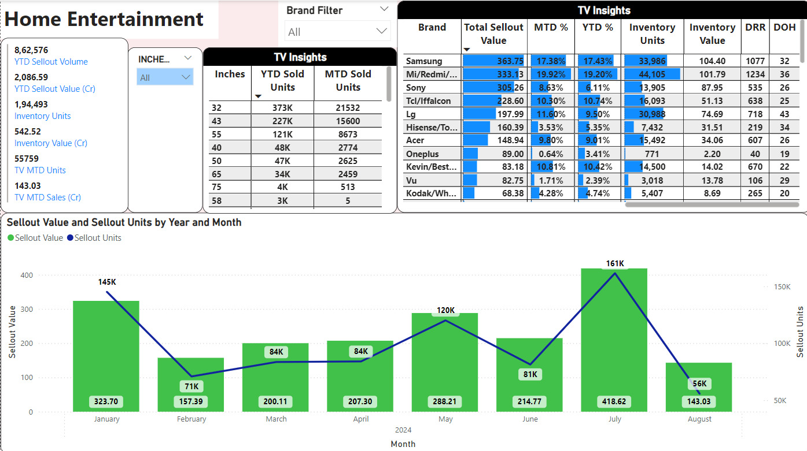
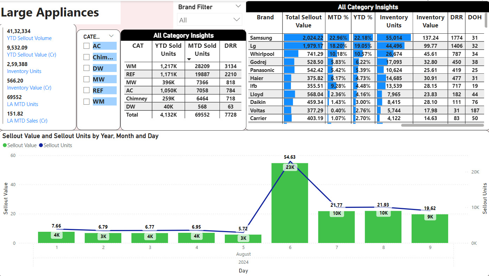
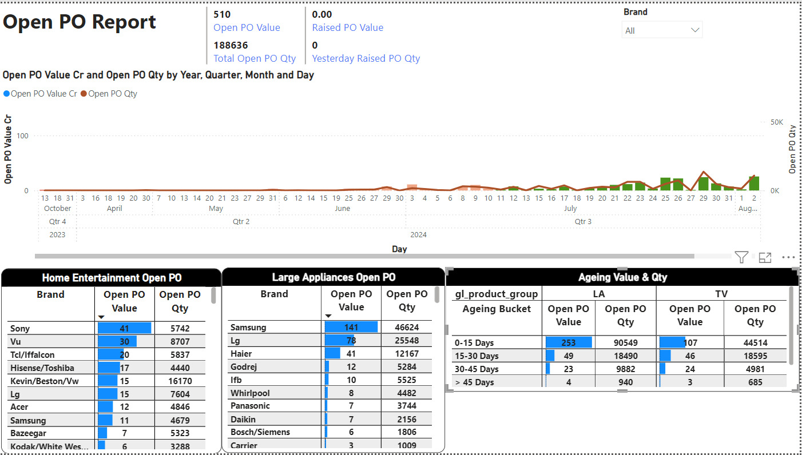

# Sales Analysis

## Introduction
This is a power bi project on sales analysis of a imaginary seller company. This seller sells home entertainment and large appliances.
This project is to analyze and derive insights to answer crucial questions and help to seller make data driven decisions

Disclaimer: All datasets and reports do not represent any company but just a dummy dataset to demonstrate capabilities of Power BI.

## Problem Statement
1. Month wise Sales trend for Home Entertainment & Day wise for Large Appliances
2. What is Year to Date (YTD) sellout volume & value
3. What is Inventory availabe for Home Entertainment & Large Appliances
4. What is Moth to Date (MTD) sellout volume & value
5. Inchwise Home Entertainment (TV) insights
6. Category wise Large Aplliacnces insights
7. Top 10 performing brands
8. Which Brand has highest Inventory contribution
9. Calculate DRR (Daily Run Rate) of Sales for Top 10 Brands
10. Calculate DOH (Days on Hand) of Inventory for Top 10 Brands
11. What is the value of Open Purchase Order (Open PO) whcih was created before 45 days

## Skills & Concept demonstrated
The following Power BI features were incorporated.
-Power Query (For data cleaning)
-DAX
-Quick Measures
-Modelling
-Filters

## Data Cleaning
I have added sample screenshot of Power Query.
- Removed unnecessary columns
- Changed Data Types
- Filtered Rows
- Replaced the Values & Null as required
- Added custom column
  

## Modelling 
Power BI automatically connected related tables resulting in a star schema model. 

I have adjusted the model as per my requirement.

In my current project 1 Fact Table is connected to 3 Dimension Table (1 to Many(*)) there by forming Star Schema

## DAX
I have added few snapshots below. And following DAX were used.
- CALCULATE
- SUMX
- FILTER
- DATESBETWEEN
- DATESYTD
- DATESQTD
- DATESMTD
- DIVIDE
- VAR
- SWITCH
- ISBLANK
- RELATED
- TODAY
  

## Visualization
The report comprise of 3 Pages.
1. Home Entertainment (TV) Sales
2. Major/Large Appliances (LA) Sales
3. Open PO Report

Features:
- For TV, Brand & Inches Filter is given to check for specific Brand & Inches level
- For Major Appliances, Brand & Category filter is given to check for specific Brand & Category level
- In Open PO Report, Brand filter is given to see the Open PO trend and ageing 

## Analyis
Home Entertainment:
- Sales trend is shown
- All the values YTD Sellout Volume & Value, Inventory Volume & Value, MTD Sellout Volume & Value, Daily Run Rate (DRR), Days on Hand (DOH)
  

Large (Major) Appliances
- Sales trend is shown
- All the values YTD Sellout Volume & Value, Inventory Volume & Value, MTD Sellout Volume & Value, Daily Run Rate (DRR), Days on Hand (DOH)
  

Open PO Report:
- Open PO trend is shown
- Ageing was shown with Value & Volume

## Conclusion
